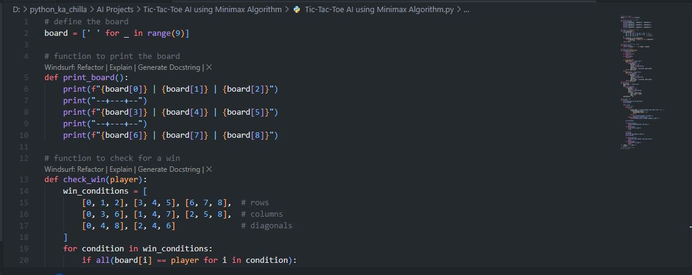
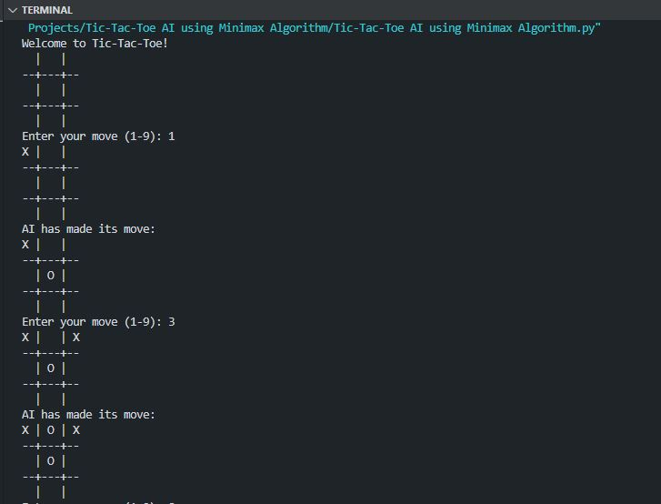

# ❌⭕ Tic‑Tac‑Toe AI using Minimax Algorithm 🤖  
   

<p align="center">
  
</p>

🚀 This project implements a classic **Tic‑Tac‑Toe** game where a human player (X) faces an AI opponent (O) that uses the **Minimax algorithm** to make optimal moves. The AI is unbeatable – at best you can force a draw! Perfect for understanding game theory, recursion, and adversarial search in AI.

---

## ✨ Key Features  
🎮 **Human vs. AI** – Play as `X` against an AI that never loses  
🧠 **Minimax Algorithm** – Recursive decision making with win/loss/draw evaluation  
🖥️ **Command‑Line Interface** – Simple text‑based board display  
🔄 **Move Validation** – Ensures only empty positions can be chosen  
🏆 **Win/Draw Detection** – Automatically recognises game‑end conditions  

---

## 🧠 Tech Stack  
- **Language:** Python 🐍  
- **Algorithm:** Minimax (with alternating maximizer/minimizer roles)  
- **Concepts:** Recursion, Game Trees, Heuristic Evaluation  

---

## 📦 Installation  

```bash
git clone https://github.com/SayabArshad/Tic-Tac-Toe-AI-Minimax.git
cd Tic-Tac-Toe-AI-Minimax
```

No external libraries are required – only Python’s standard library.


---

## ▶️ Usage

Run the main script:

```bash
python "Tic-Tac-Toe AI using Minimax Algorithm.py"
```

The game will:

Display an empty board with positions numbered 1‑9.

Prompt you to enter your move.

After your move, the AI calculates and plays its optimal response.

The board updates after each turn.

The game ends when someone wins or the board is full (draw).

Sample run:
(see the Output Preview below)

---

## 📁 Project Structure

```
Tic-Tac-Toe-AI-Minimax/
│-- Tic-Tac-Toe AI using Minimax Algorithm.py  
│-- README.md                                   
│-- assets/                                     
│    ├── code.JPG
│    └── output.JPG
```
---

## 🖼️ Interface Previews

| 📝 Code Snippet | 📊 Console Output |
|:---------------:|:-----------------:|
|  |  |

---

## 💡 How It Works – The Minimax Algorithm

Minimax is a recursive algorithm used for decision making in two‑player zero‑sum games. In this implementation:

Maximizing player is the AI (O), aiming to maximise its score.

Minimizing player is the human (X), aiming to minimise the AI’s score.

Scores:

+1 if AI wins

-1 if human wins

0 if draw

The algorithm explores all possible moves from the current board, recursively evaluating future moves until a terminal state (win/draw) is reached. It then propagates the scores back up, choosing the move that yields the best outcome for the current player.

This guarantees that the AI never makes a mistake – it always picks the optimal move.

---

## 🧑‍💻 Author

**Developed by:** [Sayab Arshad Soduzai](https://github.com/SayabArshad) 👨‍💻

📅 **Version:** 1.0.0

📜 **License:** MIT License

---

## ⭐ Contributions

Contributions are welcome! Feel free to fork the repository, open issues, or submit pull requests. Ideas for improvement:

Add a difficulty setting (limit search depth)

Create a GUI version (Tkinter / Pygame)

Implement Alpha‑Beta pruning for efficiency

If you find this project helpful, please ⭐ star the repository to show your support!

---

## 📧 Contact

For queries, collaborations, or feedback, reach out at **[sayabarshad789@gmail.com](mailto:sayabarshad789@gmail.com)**m

---

❌⭕ Can you beat the unbeatable?

---
